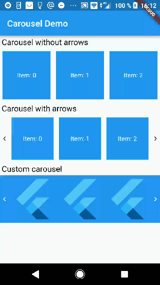

# Flutter carousel

Flutter carousel slider widget, allow render cells with Drag-and-drop animation.

## Installation

Add `flutter_mobile_carousel: ^1.0.0` in your `pubspec.yaml` dependencies. Import the library via:

```dart
import 'package:flutter_mobile_carousel/carousel.dart';
```

## Run example
In repository directory run this commands in terminal:

```
cd example
flutter run
```



## Usage

Create simple `Carousel` widget:

```dart
Carousel(
  rowCount: 3,
  children: [
    'Item 1',
    'Item 2',
    'Item 3',
    'Item 4',
    'Item 5',
    'Item 6',
  ].map((String itemText) {
    return DefaultCarouselItem(itemText);
  }).toList()
),
```

You can watch more examples in `example` directory

